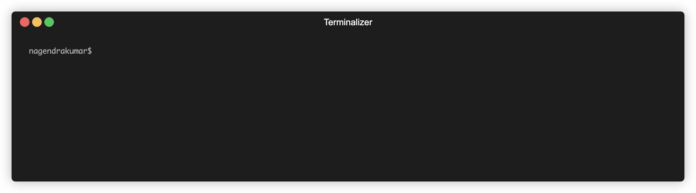

# QuickDev Setup


A comprehensive developer environment setup tool with interactive menus and automated installation. **Currently supports macOS only** with **Linux support coming soon**.

## � Screenshots

### 🎬 Live Demo


*Interactive demo showing the main menu, language runtimes, and CLI tools installation*

## �🚀 Quick Install

### Method 1: One-line installer
```bash
curl -fsSL https://raw.githubusercontent.com/Nagendracse1/quickdev-setup/main/install.sh | bash
```

### Method 2: Manual install
```bash
# Clone the repo
git clone https://github.com/Nagendracse1/quickdev-setup.git
cd quickdev-setup

# Install globally
chmod +x install.sh
./install.sh

# Or run directly
chmod +x setup.sh
./setup.sh
```

### Method 3: Homebrew (Future)
```bash
# Add tap (when published)
brew tap Nagendracse1/quickdev-setup
brew install quickdev-setup

# Run
quickdev-setup
```

### Method 4: npm (Future)
```bash
npm install -g quickdev-setup
# Run
quickdev-setup
```

## 🗑️ Uninstall

### Method 1: Using the installer script
```bash
# Download and run uninstaller
curl -fsSL https://raw.githubusercontent.com/Nagendracse1/quickdev-setup/main/install.sh | bash -s uninstall
```

### Method 2: Manual removal
```bash
# Remove the installed binary
sudo rm -f /opt/homebrew/bin/quickdev-setup
# or
sudo rm -f /usr/local/bin/quickdev-setup

# Optionally remove configuration files
rm -rf ~/.quickdev-config.json
rm -rf ~/.quickdev-plugins/
```

### Method 3: Homebrew uninstall (Future)
```bash
brew uninstall quickdev-setup
brew untap Nagendracse1/quickdev-setup
```

## 🛠 Features

- **🍎 macOS Support**: Fully tested and optimized for macOS
- **🐧 Linux Support**: Coming soon (Ubuntu, CentOS, RHEL planned)
- **🍺 Package Managers**: Homebrew for macOS (APT/YUM planned for Linux)
- **💻 Language Runtimes**: Node.js, Ruby, Go, Java, PHP with version management
- **🛠️ CLI Tools**: Git, Docker, Kubectl, Terraform, AWS CLI, MongoDB tools
- **📱 GUI Applications**: VS Code, Chrome, Slack, Discord, etc.
- **🐚 Shell Enhancement**: Oh My Zsh, Powerlevel10k, plugins
- **🐳 Docker & Databases**: MongoDB, Redis, PostgreSQL, Kafka, Google Cloud emulators
- **🔑 Git Configuration**: User setup, SSH keys, credential helper
- **🚀 Auto-Detection**: Automatically detects macOS and uses Homebrew

## 📖 Usage

### Interactive Mode
```bash
quickdev-setup
```

### Command Line Options
```bash
quickdev-setup --help                 # Show help
quickdev-setup --auto                 # Install everything automatically
quickdev-setup --languages            # Setup language runtimes only
quickdev-setup --cli-tools            # Install CLI tools only
quickdev-setup --docker               # Setup Docker and databases
quickdev-setup --git                  # Configure Git only

# Combine multiple components
quickdev-setup --brew --languages --git
```

### Specific Components
- `--brew` - Install/update Homebrew
- `--languages` - Setup Node.js, Ruby, Go, Java, PHP
- `--cli-tools` - Install development CLI tools  
- `--gui-apps` - Install GUI applications
- `--shell-tools` - Setup Oh My Zsh, themes, plugins
- `--docker` - Setup Docker containers and databases
- `--git` - Configure Git user, SSH keys, credentials

## 🎯 What Gets Installed

### Language Runtimes
- **Node.js** via NVM with version selection (includes Yarn package manager)
- **Ruby** via rbenv with version selection
- **Go** with latest or specific versions
- **Java** OpenJDK with version selection  
- **PHP** with Composer and PECL support

### CLI Tools
- Git, GitHub CLI, Docker, Docker Compose
- Kubernetes (kubectl), Terraform, AWS CLI
- MongoDB shell and database tools
- Colima (Docker Desktop alternative)

### GUI Applications  
- Visual Studio Code, Google Chrome
- MongoDB Compass, Postman, Notion
- Slack, Discord, Figma, Warp terminal

### Shell Enhancement
- Oh My Zsh framework
- Powerlevel10k theme with auto-configuration
- Zsh autosuggestions and syntax highlighting (properly configured for immediate use)
- Claude AI CLI tool
- Yarn package manager (alternative to npm)

### Docker Services
- MongoDB, Redis, PostgreSQL containers
- Kafka with KRaft mode and Kafka UI
- Google Cloud Pub/Sub emulator
- Automated container management

## 🔧 Development

### Project Structure
```
quickdev-setup/
├── setup.sh           # Main setup script (macOS)
├── install.sh          # Global installer
├── scripts/
│   ├── macos/         # macOS-specific scripts
│   └── linux/         # Linux-specific scripts (coming soon)
├── README.md          # This file
├── LICENSE            # MIT license
└── .github/
    └── workflows/
        └── test.yml   # CI/CD pipeline
```

### Contributing
1. Fork the repository
2. Create a feature branch
3. Make your changes
4. **Test on clean macOS system**
5. Submit a pull request

### Testing
```bash
# Test on macOS (current)
./setup.sh --help

# Test specific components
./setup.sh --languages
./setup.sh --cli-tools

# Linux testing (planned for future)
# docker run -it --rm -v $(pwd):/workspace ubuntu:latest bash
# cd /workspace && ./setup.sh --help
```

## 🚧 Roadmap

### ✅ Current (v1.0.0)
- Full macOS support with Homebrew
- Interactive and CLI modes
- All major development tools

### 🔄 Coming Soon (v1.1.0)
- **Linux support** (Ubuntu, CentOS, RHEL)
- **APT/YUM package managers**
- **Cross-platform compatibility testing**

### 🎯 Future (v2.0.0)
- Windows support with Chocolatey
- Docker-based installation option
- Team configuration templates

## 📝 License

MIT License - see [LICENSE](LICENSE) file for details.

## 🤝 Support

- 📧 Issues: [GitHub Issues](https://github.com/Nagendracse1/quickdev-setup/issues)
- 💬 Discussions: [GitHub Discussions](https://github.com/Nagendracse1/quickdev-setup/discussions)  
- 📚 Wiki: [Project Wiki](https://github.com/Nagendracse1/quickdev-setup/wiki)
- 🐛 Bug Reports: Create detailed issues with reproduction steps
- 💡 Feature Requests: Share your ideas for improvements

## 🙏 Credits

**Developed by:** [Nagendra Kumar](https://github.com/Nagendracse1)   
**Development:** Created with AI assistance to streamline developer onboarding and environment setup

Created to streamline developer onboarding and environment setup for macOS developers, with cross-platform support planned for the global developer community.